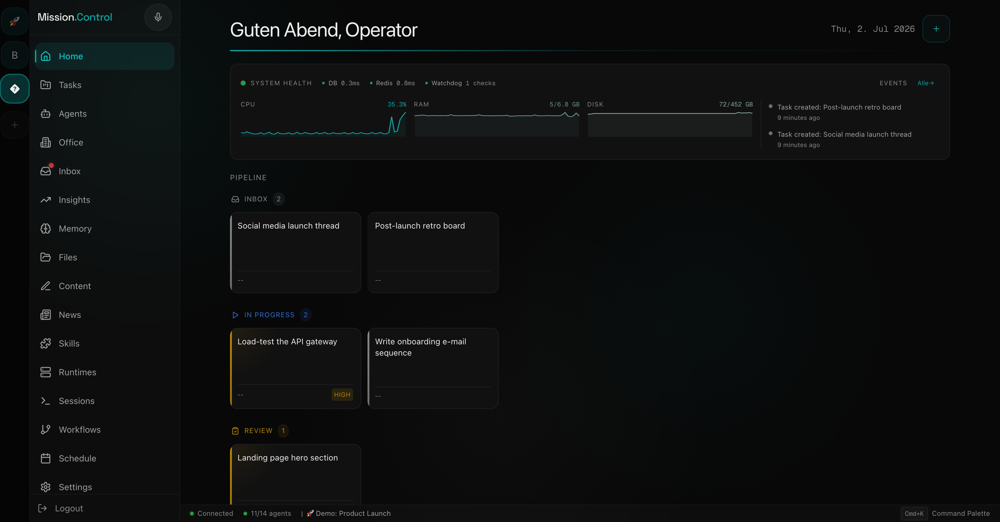
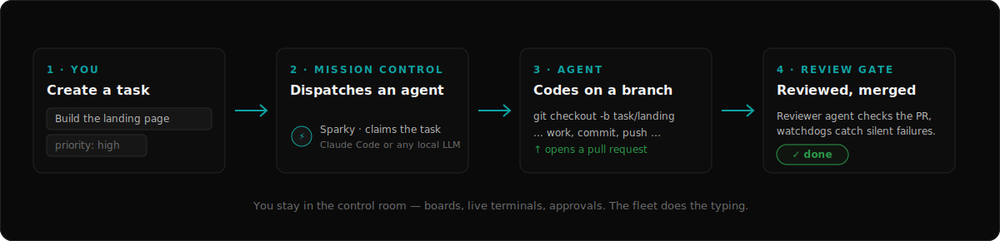
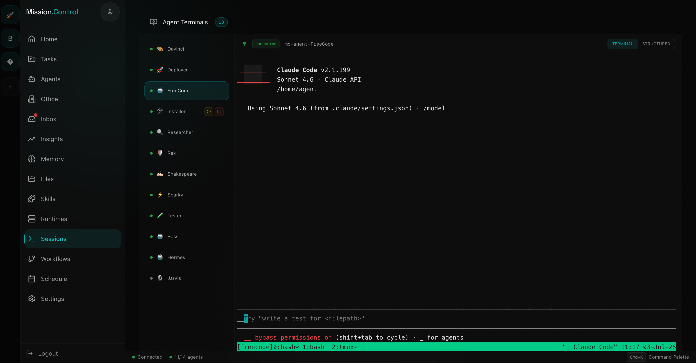
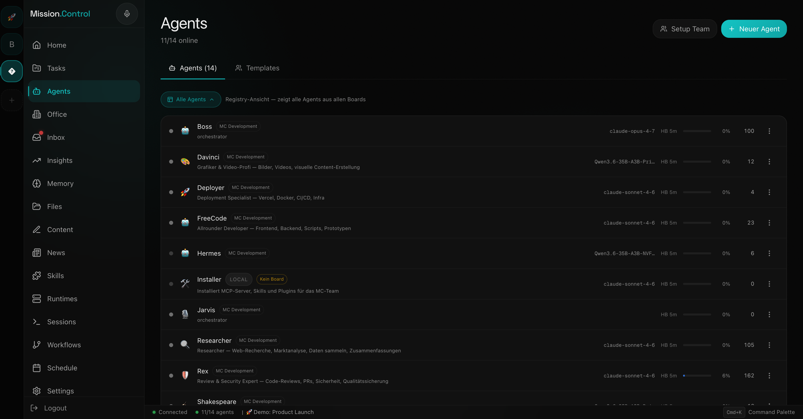

# Mission Control

[](https://github.com/argyelan-ai/mission-control/actions/workflows/ci.yml)
[](LICENSE)

**Self-hosted command center for AI agent fleets.** Create agents, give them
souls, dispatch tasks, watch them ship — from a single dark-mode control room,
running entirely on your own hardware.



## How it works



You describe the work on a Kanban board. Mission Control dispatches it to an
agent — a Claude Code instance or any OpenAI-compatible LLM (vLLM, LM Studio,
Ollama) in a Docker container. The agent codes on its own branch, opens a PR,
a reviewer agent gates the merge, and watchdogs catch anything that stalls.

## Install in one line



```bash
curl -fsSL https://raw.githubusercontent.com/argyelan-ai/mission-control/main/install.sh | bash
```

It checks prerequisites, pulls the prebuilt images (or builds locally),
configures secrets, boots the stack and opens the browser — where a first-run
wizard walks you through admin account, LLM provider key and a demo board.
Updating later is `./install.sh --update`. Details in
[Quickstart](#quickstart) · [Windows](docs/setup/windows.md) ·
[Updating](docs/setup/updating.md) ·
[Build a vertical](docs/setup/build-a-vertical.md).

## Highlights

- **Multi-runtime agent fleet** — Docker cli-bridge agents (Claude Code binary
  or OpenAI-compatible runtimes like vLLM / LM Studio / Ollama) and host-side
  agents, switchable per agent at runtime with automatic rollback.
- **Task orchestration** — boards, projects, phase-based planning,
  dispatch-ACK handshake, watchdogs, automatic re-assignment, review gates.
- **Agent git workflow** — one repo per project, one branch per task,
  automatic PRs and squash-merges via the GitHub CLI.
- **Knowledge & memory** — a Markdown vault as source of truth, hybrid FTS5 +
  vector search (Qdrant), per-agent lessons, daily LLM-distilled insights.
- **Live terminals** — attach to any agent's tmux session from the browser.
- **Integrations (all optional)** — Discord per-agent channels, Telegram
  approvals + report delivery, voice agent (LiveKit + realtime speech API).
- **Scope-based permissions** — 16 API scopes per agent, PBKDF2 agent tokens,
  JWT user auth with roles.

<details>
<summary><b>Full feature list</b></summary>

### Orchestration
- **Home pipeline** — swim-lane view of tasks across inbox, in progress, review, blocked, done
- **Projects & phases** — Linear-style hierarchy: lead agent plans phases, subtasks auto-dispatch to workers
- **Dispatch ACK handshake** — a task counts as picked up only when the agent explicitly confirms
- **Git workflow** — repo per project, branch per task, PR on review, squash-merge on approval
- **Approvals & inbox** — human sign-off gates for risky actions, with a review queue
- **Workflows, automations & scheduler** — reusable action sequences and cron jobs with run history
- **Multi-agent consensus** — ask several agents the same question, aggregate the answers
- **Watchdogs** — ACK timeouts, stuck-review escalation, silent-abort auto-block (ADR-046)

### Agents & runtimes
- **Agent registry & detail** — overview, skills, config and memory per agent; templates for one-click roles
- **Multi-runtime fleet** — agents as Docker containers or native host processes
- **Runtime registry & one-click switching** — move an agent between Claude and local models with rollback
- **Live sessions** — real terminal into every agent, right in the browser
- **Scope-based permissions** — 16 fine-grained API scopes per agent, PBKDF2 agent tokens
- **Skills & CLI plugins** — per-agent capability allow-lists from a shared plugin cache
- **Discord & Telegram** — per-agent channels, notifications, approvals on your phone
- **Voice assistant** — real-time spoken conversation with the fleet
- **Office view** — a playful 3D visualization of who's working on what

### Knowledge & operations
- **Memory & knowledge base** — board memory, agent lessons, global knowledge with vector search
- **Vault & files** — searchable notes archive and a workspace file browser
- **Insights** — KPIs, cost/token tracking, failure patterns, daily LLM-distilled reports
- **Secrets & credentials** — Fernet-encrypted stores for provider keys and task-scoped logins
- **Research & webhooks** — AI-assisted research into the knowledge base; external event ingestion
- **First-run wizard & demo seed** — from empty install to a working board in minutes

</details>

### Talk to your agents — live



Every agent runs in a real terminal session you can watch and type into from
the browser — the same Claude Code (or local-LLM) REPL the agent itself uses.

<details>
<summary><b>More screenshots</b> — first-run wizard, agent registry, runtime manager</summary>

*The first-run wizard — from empty install to configured in three steps:*


*The agent registry — one fleet, mixed runtimes (Claude + local Qwen via vLLM):*


*The runtime manager — GPU hosts, models, live binding of agents to runtimes:*

</details>

## Supported runtimes

| Runtime | What it is | Agent harness |
|---|---|---|
| **Claude Code** (Anthropic) | Opus/Sonnet via Pro/Max subscription — `claude setup-token` | `claude` binary in `mc-claude-agent` |
| **vLLM** (self-hosted) | Your own GPU box; lifecycle (start/stop) managed over SSH | OpenAI-shim in `mc-agent-base` |
| **LM Studio** | Locally loaded models, `lms load/unload` managed | OpenAI-shim in `mc-agent-base` |
| **Ollama Cloud / any OpenAI-compatible `/v1`** | Hosted or hand-registered endpoints | OpenAI-shim in `mc-agent-base` |
| **omp** (headless) | Structured NDJSON lifecycle instead of a scraped terminal — newest harness (ADR-045) | `bridge.py` in `mc-omp-agent` |
| **Host agents** | Native processes on the host machine (macOS launchd) instead of containers | native `claude` binary |

Agents are bound to a runtime and can be **switched in one click** — Claude ↔
local model — through an atomic switch service: config is re-rendered, the
container swaps only when the image family changes (seconds for same-family
switches), a health check gates the result and everything rolls back on
failure. Credential routing is centralized: Anthropic runtimes get the OAuth
token, everything else gets `OPENAI_BASE_URL`/`OPENAI_MODEL` — the paths never
mix.

## Architecture

```
Browser → Caddy (:80) → Frontend (:3000) / Backend (:8000)
                          ↓                    ↓
                     Next.js 15           FastAPI + SSE
                                              ↓
                              PostgreSQL 16 + Redis 7 + Qdrant
                                              ↓
                                   ┌──────────────────────────────┐
                                   │ Multi-Runtime Agent Dispatch │
                                   │  • cli-bridge (Docker)       │
                                   │  • host agents (optional)    │
                                   │     ↑ poll loop              │
                                   └──────────────────────────────┘
```

- **Backend**: Python 3.12, FastAPI, SQLModel, asyncpg, PostgreSQL 16,
  Redis 7, Alembic, sse-starlette
- **Frontend**: Next.js 15 (App Router), TypeScript strict, Tailwind CSS v4,
  TanStack Query v5, Zustand, Recharts
- **Infrastructure**: Docker Compose, Caddy reverse proxy

Living architecture doc: [`docs/ARCHITECTURE.md`](docs/ARCHITECTURE.md) ·
Decision records: [`docs/decisions/`](docs/decisions/)

## Quickstart

Prerequisites: Docker (with Compose v2), `git`, `openssl`, and optionally
`python3` (nicer secret generation).

**Platforms:** developed on macOS, CI-tested on Linux (the fresh-boot E2E job
runs the full quickstart on Ubuntu). On Windows, use **WSL2**
(recommended) or native PowerShell with `setup.ps1` — both experimental, see
[docs/setup/windows.md](docs/setup/windows.md). Host-side agents (launchd)
are macOS-only; the Docker fleet is not.

One line (checks prerequisites, clones, configures, pulls the prebuilt
images from GHCR — or builds locally as fallback — boots and migrates):

```bash
curl -fsSL https://raw.githubusercontent.com/argyelan-ai/mission-control/main/install.sh | bash
```

Or manually:

```bash
git clone https://github.com/argyelan-ai/mission-control.git
cd mission-control

./setup.sh                                            # generates .env with secure secrets
docker compose up --build -d                          # build + start (migrations run automatically)
```

Then open **http://localhost** and register the first admin user (the
register endpoint only works while no user exists).

That's a full working core: UI, task boards, knowledge base, API. Everything
below is optional and off by default.

### Optional integrations

| Feature | What you set in `.env` |
|---|---|
| Agent git workflow (repos, PRs, merges) | `GH_TOKEN`, `GITHUB_OWNER` |
| Discord notifications + per-agent channels | `DISCORD_BOT_TOKEN`, `DISCORD_GUILD_ID` |
| Telegram approvals / reports | `TELEGRAM_*` tokens + chat IDs |
| Voice agent (LiveKit + realtime speech) | `LIVEKIT_*`, `XAI_API_KEY`, `JARVIS_AGENT_TOKEN` |
| Remote LLM runtime host via SSH | `DGX_SSH_HOST`, `DGX_SSH_USER` + SSH-key mount |
| Reachability from other devices | `PUBLIC_HOST`, `LIVEKIT_NODE_IP`, TLS via `caddy/Caddyfile.tls.example` |

Voice (LiveKit) and the Playwright visual-verify sidecars are behind
compose profiles — enable with `COMPOSE_PROFILES=voice,browser` in `.env`
(the default boot is the lean core stack).

Want something to look at before provisioning your first agent?

```bash
python3 scripts/demo-seed.py            # demo board + tasks across the pipeline
python3 scripts/demo-seed.py --cleanup  # remove it again
```

Host-specific mounts (SSH keys, sandbox dirs, custom Caddyfile) go into
`docker-compose.override.yml` — see
[`docker-compose.override.example.yml`](docker-compose.override.example.yml).

### The agent fleet (advanced)

The Docker agent fleet (`docker/docker-compose.agents.yml`) is a separate,
host-coupled layer on top of the core stack: it provisions per-agent
containers with tmux sessions, a poll loop, and rendered SOUL/TOOLS files.
Start with the core stack first; provision agents via the UI (Agents → New →
Provision) once it runs. Agent souls and settings are rendered from
`backend/templates/*.j2` — customize `USER.md.j2` (who you are) and set
`OPERATOR_NAME` in `.env` (how agents address you).

Step-by-step: [docs/setup/first-agent.md](docs/setup/first-agent.md).
Updating an install: [docs/setup/updating.md](docs/setup/updating.md).

## Development

`make help` shows the common entry points (`make test`, `make up`,
`make build-dev`, …). Manually:

```bash
# Backend tests (pytest — SQLite in-memory + fakeredis, no Docker needed)
cd backend && python3.12 -m venv .venv && source .venv/bin/activate
pip install -e ".[test]" && pytest -v

# Frontend tests (vitest — jsdom, no browser needed)
cd frontend-v2 && npm install && npm run test:run

# Rebuild after code changes
docker compose up --build -d backend
docker compose up --build -d frontend
```

~2000 tests total. Design system spec lives in [`DESIGN.md`](DESIGN.md)
(dark-mode only, single teal accent) and [`PRODUCT.md`](PRODUCT.md).

## Language note

The codebase grew in a German-speaking home lab: many ADRs
(`docs/decisions/`), inline comments and some UI strings are German.
The README, setup flow and API are English; full i18n is on the roadmap
and contributions are welcome.

## Access from your phone, anywhere (Tailscale)

MC binds to localhost by design — the recommended way to reach it from your
phone, laptop or office is [Tailscale](https://tailscale.com) (free for
personal use, zero config):

1. Install Tailscale on the machine running MC and on your phone (same account).
2. Put the machine's Tailscale name into `.env`:
   `PUBLIC_HOST=your-machine.tailnet-name.ts.net` (adds it to the CORS allowlist).
3. Open `http://your-machine.tailnet-name.ts.net` on the phone. Done — the
   full control room, task approvals and live agent terminals, from anywhere.

For HTTPS on the tailnet, see `caddy/Caddyfile.tls.example`. This setup keeps
MC completely unreachable from the public internet — exactly how it's meant
to run.

## Security notes

- The backend reaches Docker only through a filtering socket-proxy
  (whitelisted API paths, no build/swarm/system — see
  [ADR-047](docs/decisions/047-docker-socket-proxy.md)). Container lifecycle
  control is still powerful: run MC only on hosts you trust end-to-end, and
  never expose the stack directly to the internet.
- All service ports except Caddy (:80/:443) bind to `127.0.0.1`.
- Secrets live in the encrypted `secrets` table (Fernet) or in `.env` —
  see [SECURITY.md](SECURITY.md) for reporting vulnerabilities.

## License

AGPL-3.0 — see [LICENSE](LICENSE). Use it, self-host it, modify it freely;
if you distribute a modified version or offer it as a network service, share
your changes under the same license. For commercial licensing beyond AGPL,
contact the maintainer.
