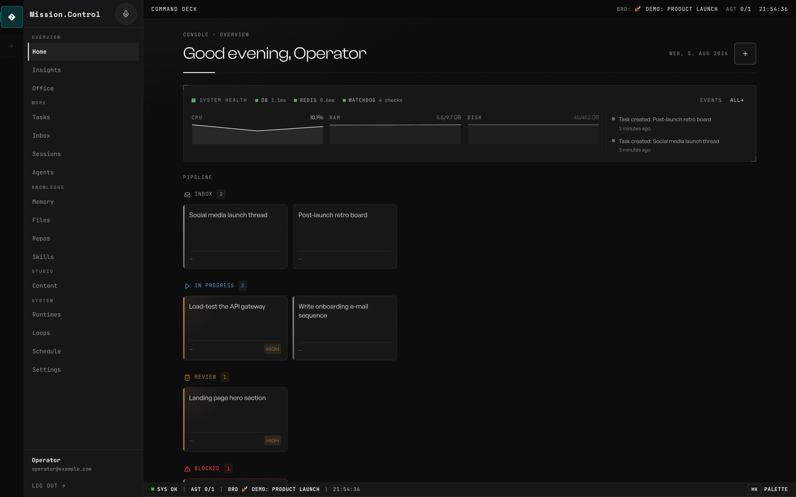
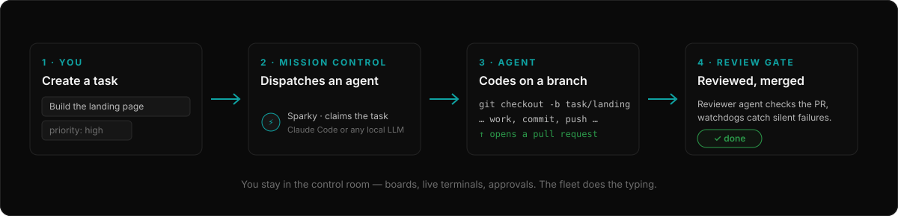
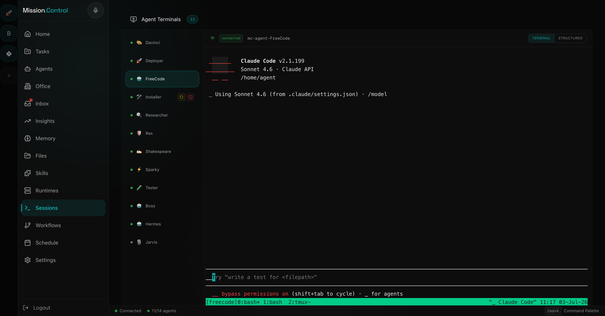
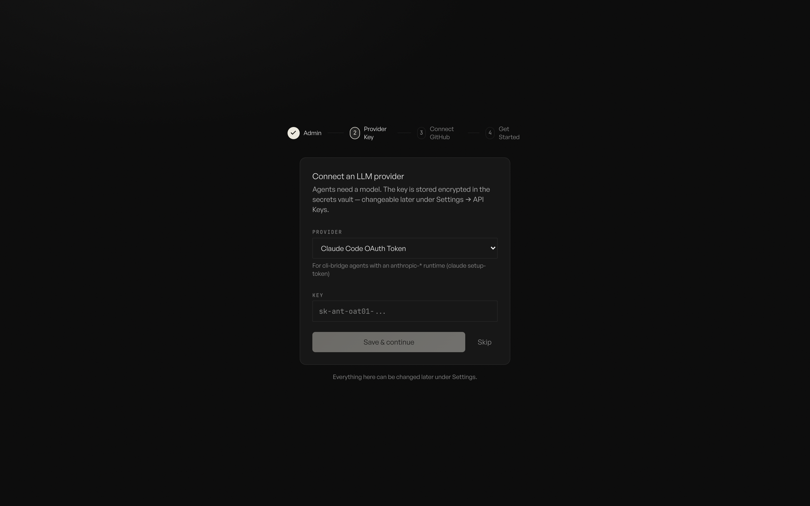
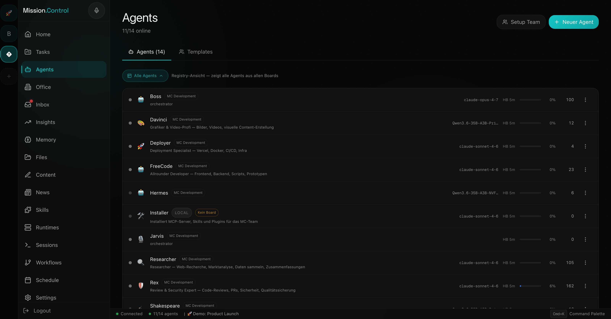

<div align="center">

# Mission Control

**Your self-hosted AI agent fleet — with guardrails, a real git workflow
and zero cloud.**

Create agents, give them souls, dispatch tasks, watch them ship — from a
single dark-mode control room, running entirely on your own hardware.

[](https://github.com/argyelan-ai/mission-control/actions/workflows/ci.yml)
[](https://github.com/argyelan-ai/mission-control/releases)
[](LICENSE)

[](#run-your-own-models--zero-cloud)
[](#run-your-own-models--zero-cloud)
[](#run-your-own-models--zero-cloud)
[](#run-your-own-models--zero-cloud)
[](#run-your-own-models--zero-cloud)

[Install](#install-in-one-line) · [Why](#why-mission-control) ·
[Platforms](#runs-on) · [Docs](docs/) · [Roadmap](#roadmap) ·
[Community](#community)



</div>

## Why Mission Control

Running one AI coding agent is easy. Running several is chaos — and that's
the problem Mission Control exists to solve:

- **Terminals everywhere.** Five agents in five windows, no overview of who
  is doing what, no record of what happened overnight. MC gives you one
  control room: task boards, live terminals, full history.
- **No guardrails.** Agents stall silently, wander off-task, or need a
  babysitter. MC adds structure: a dispatch handshake (work counts as picked
  up only when the agent confirms), watchdogs for everything that hangs,
  review gates before anything merges, human approvals for risky actions.
- **The cloud sees your code.** Agent SaaS means your repos and prompts on
  someone else's servers. MC is fully self-hosted — and if you pair it with
  vLLM, LM Studio or Ollama, nothing leaves your network. Not the code, not
  the prompts, not the model.
- **From prompt to merge is a manual slog.** Copy-pasting agent output into
  commits doesn't scale. In MC every task gets its own branch, an automatic
  PR and a review — the way a real team works.
- **Paying twice for the same model.** Most agent platforms want an API key
  and bill per token — on top of the Claude subscription you already have.
  MC runs the real Claude Code binary on your **existing Pro/Max plan**
  (`claude setup-token`): no API key, no separate metered bill. Or skip
  Anthropic entirely and use your own GPU.

## How it works



You describe the work on a Kanban board. Mission Control dispatches it to an
agent — a Claude Code instance or any OpenAI-compatible LLM (vLLM, LM Studio,
Ollama) in a Docker container. The agent codes on its own branch, opens a PR,
a reviewer agent gates the merge, and watchdogs catch anything that stalls.

## Install in one line



```bash
curl -fsSL https://raw.githubusercontent.com/argyelan-ai/mission-control/main/install.sh | bash
```

It checks prerequisites, pulls the prebuilt images (or builds locally),
configures secrets, boots the stack and opens the browser — where a first-run
wizard walks you through admin account, LLM access (an API key — or just your
existing Claude subscription) and a demo board.
Updating later is `./install.sh --update`.

### Runs on

| Platform | Path | Effort |
|---|---|---|
| **Linux server / NAS** (headless) | the one-liner above | ~5 min |
| **macOS** | the one-liner above | ~5 min |
| **Runtipi** | [community app store](https://github.com/argyelan-ai/tipi-store) — add it under *Settings → App Stores*, then install from the store | 2 clicks |
| **Portainer** | [`deploy/catalogs/portainer-template.json`](deploy/catalogs/portainer-template.json) as an App Template source | a few clicks |
| **Umbrel / CasaOS** | manifests [prepared](deploy/catalogs/), store submissions in progress | — |
| **Windows 10/11** | WSL2 + the one-liner — [guide](docs/setup/windows.md); a one-click bootstrapper is on the [roadmap](#roadmap) | ~10 min |
| **Windows Server / company VM** (Hyper-V, VMware ESXi) | a small Linux VM next to your Windows VMs — [guide](docs/setup/windows.md#windows-server--company-hypervisors) | ~10 min |

Details: [Quickstart](#quickstart) · [Windows](docs/setup/windows.md) ·
[Updating](docs/setup/updating.md) ·
[Build a vertical](docs/setup/build-a-vertical.md).

## Run your own models — zero cloud

Mission Control treats local LLMs as first-class citizens, not a fallback.
Point an agent at any OpenAI-compatible endpoint — a vLLM box with your GPU,
LM Studio on your desktop, Ollama, or a hosted `/v1` — or run Claude Code
with your Anthropic subscription. Mix both in one fleet.

**Already on Claude Pro or Max? You're done.** Agents run the genuine Claude
Code binary authenticated via `claude setup-token` — your existing
subscription powers the whole fleet. No API key, no second metered bill.

| Runtime | What it is | Agent harness |
|---|---|---|
| **Claude Code** (Anthropic) | Opus/Sonnet via Pro/Max subscription — `claude setup-token` | `claude` binary in `mc-claude-agent` |
| **vLLM** (self-hosted) | Your own GPU box; lifecycle (start/stop) managed over SSH | OpenAI-shim in `mc-agent-base` |
| **LM Studio** | Locally loaded models, `lms load/unload` managed | OpenAI-shim in `mc-agent-base` |
| **Ollama Cloud / any OpenAI-compatible `/v1`** | Hosted or hand-registered endpoints | OpenAI-shim in `mc-agent-base` |
| **omp** (headless) | Structured NDJSON lifecycle instead of a scraped terminal — newest harness (ADR-045) | `bridge.py` in `mc-omp-agent` |
| **Host agents** | Native processes on the host machine (macOS launchd) instead of containers | native `claude` binary |

Agents are bound to a runtime and can be **switched in one click** — Claude ↔
local model — through an atomic switch service: config is re-rendered, the
container swaps only when the image family changes (seconds for same-family
switches), a health check gates the result and everything rolls back on
failure. Credential routing is centralized: Anthropic runtimes get the OAuth
token, everything else gets `OPENAI_BASE_URL`/`OPENAI_MODEL` — the paths never
mix.

## Highlights

**Orchestration with guardrails**
Boards, projects and phase-based planning; a dispatch-ACK handshake so no
task silently disappears; review gates and human approval queues;
autonomous loops that grind through a backlog round by round — each round
passing the same gates (ADR-051); cron automations with run history;
16 fine-grained API scopes per agent.

**Resilient by design**
Watchdogs for timeouts, stuck reviews and silent aborts; automatic
re-assignment when an agent goes dark; **context recovery** — a crashed or
recycled agent reconstructs its task thread and keeps going instead of
starting from zero; runtime switches roll back automatically on failed
health checks; automatic daily backups (`make backup-schedule`).

**A real git workflow**
One repo per project, one branch per task, automatic PRs and squash-merges
via the GitHub CLI. A first-class repos registry with per-repo work rules
(test commands, branch policy, house style) injected into every dispatch.

**Your fleet, in your pocket**
Run the whole operation from Slack: dispatch work by chat message, get
reports and files back in-thread, approve risky actions from your phone —
plus Discord per-agent channels, Telegram approvals and a real-time voice
assistant. Remote access via [Tailscale](#access-from-your-phone-anywhere-tailscale),
never the public internet.

**Knowledge & memory**
A Markdown vault as source of truth, hybrid full-text + vector search
(Qdrant), per-agent lessons, daily LLM-distilled insights — and full cost
transparency: token spend and cost per agent and per task.

**Live & hands-on**
A real terminal into every agent from the browser — watch it work, type
into its session; one-click agent creation from role templates (reviewer,
lead, researcher); a playful 3D office view of who's working on what.

**Built in the open**
[71 architecture decision records](docs/decisions/), 5,000+ tests, and a CI
pipeline that boots a fresh install end-to-end on every commit — the same
one-liner you run is the one that's tested. Secure by default: everything
binds to localhost until you opt in, Docker is reachable only through a
filtering socket-proxy, secrets are Fernet-encrypted.

<details>
<summary><b>Full feature list</b></summary>

### Orchestration
- **Home pipeline** — swim-lane view of tasks across inbox, in progress, review, blocked, done
- **Projects & phases** — Linear-style hierarchy: lead agent plans phases, subtasks auto-dispatch to workers
- **Dispatch ACK handshake** — a task counts as picked up only when the agent explicitly confirms
- **Git workflow** — repo per project, branch per task, PR on review, squash-merge on approval
- **Repos registry** — one repo shared across projects, GitHub import, per-repo work rules injected into every dispatch (ADR-050)
- **Approvals & inbox** — human sign-off gates for risky actions, with a review queue
- **Workflows, automations & scheduler** — reusable action sequences and cron jobs with run history
- **Autonomous loops** — agents work down a backlog in rounds, every round passing the full gates (ADR-051)
- **Multi-agent consensus** — ask several agents the same question, aggregate the answers
- **Watchdogs** — ACK timeouts, stuck-review escalation, silent-abort auto-block (ADR-046)
- **Context recovery** — crashed/recycled agents reconstruct their task thread and continue (ADR-026)

### Agents & runtimes
- **Agent registry & detail** — overview, skills, config and memory per agent; templates for one-click roles
- **Multi-runtime fleet** — agents as Docker containers or native host processes
- **Runtime registry & one-click switching** — move an agent between Claude and local models with rollback
- **Live sessions** — real terminal into every agent, right in the browser
- **Scope-based permissions** — 16 fine-grained API scopes per agent, PBKDF2 agent tokens
- **Skills & CLI plugins** — per-agent capability allow-lists from a shared plugin cache
- **Slack, Discord & Telegram** — team chat with the agents, per-agent channels, notifications, approvals on your phone
- **Voice assistant** — real-time spoken conversation with the fleet
- **Office view** — a playful 3D visualization of who's working on what

### Knowledge & operations
- **Memory & knowledge base** — board memory, agent lessons, global knowledge with vector search
- **Vault & files** — searchable notes archive and a workspace file browser
- **Insights** — KPIs, cost/token tracking, failure patterns, daily LLM-distilled reports
- **Secrets & credentials** — Fernet-encrypted stores for provider keys and task-scoped logins
- **Research & webhooks** — AI-assisted research into the knowledge base; external event ingestion
- **First-run wizard & demo seed** — from empty install to a working board in minutes

</details>

### Talk to your agents — live



Every agent runs in a real terminal session you can watch and type into from
the browser — the same Claude Code (or local-LLM) REPL the agent itself uses.

### Git integration — rules that travel with the code

Mission Control manages GitHub the way a team would: **one repo per
project, one branch per task.** An agent picking up a task clones (or
already has) the project's repo, works on `task/<slug>`, and on review opens
a PR via the GitHub CLI; a reviewer agent or a human merges (squash) and the
branch is deleted. Ad-hoc tasks with no project share a single
`mc-workspace` repo instead of leaving orphaned branches around.

Repos live in a shared registry (**`/repos`**) — import an existing GitHub
repo or let Mission Control create one, link it to multiple projects, and
write **work rules** once (test commands, branch policy, house style).
Those rules are injected into every dispatch for that codebase, so an agent
working on repo X always sees X's conventions instead of a generic default.

**Connecting GitHub:** none of this needs GitHub to be reachable — MC runs
fine without it, just without version control for task work. Once you want
it, there are three equivalent ways to connect, in order of precedence:

1. **Settings → GitHub** — owner + token, applies live, no restart. A
   "Test connection" button checks login, owner reachability and rate
   limit against the live API.
2. **`install.sh`** — asks for owner + token interactively during setup
   (token entry is silent, both optional/skippable).
3. **`.env`** — classic `GITHUB_OWNER` + `GH_TOKEN`.

The first-run setup wizard also has an optional "Connect GitHub" step, and
`/repos` shows an onboarding banner until a connection is configured.
Step-by-step guide (token scopes, verifying the connection,
troubleshooting): [docs/setup/github.md](docs/setup/github.md).

<details>
<summary><b>More screenshots</b> — first-run wizard, agent registry, runtime manager</summary>

*The first-run wizard — from empty install to configured in four steps:*


*The agent registry — one fleet, mixed runtimes (Claude + local Qwen via vLLM):*


*The runtime manager — GPU hosts, models, live binding of agents to runtimes:*

</details>

## Architecture

```
Browser → Caddy (:80) → Frontend (:3000) / Backend (:8000)
                          ↓                    ↓
                     Next.js 15           FastAPI + SSE
                                              ↓
                              PostgreSQL 16 + Redis 7 + Qdrant
                                              ↓
                                   ┌──────────────────────────────┐
                                   │ Multi-Runtime Agent Dispatch │
                                   │  • cli-bridge (Docker)       │
                                   │  • host agents (optional)    │
                                   │     ↑ poll loop              │
                                   └──────────────────────────────┘
```

- **Backend**: Python 3.12, FastAPI, SQLModel, asyncpg, PostgreSQL 16,
  Redis 7, Alembic, sse-starlette
- **Frontend**: Next.js 15 (App Router), TypeScript strict, Tailwind CSS v4,
  TanStack Query v5, Zustand, Recharts
- **Infrastructure**: Docker Compose, Caddy reverse proxy

Living architecture doc: [`docs/ARCHITECTURE.md`](docs/ARCHITECTURE.md) ·
Decision records: [`docs/decisions/`](docs/decisions/)

## Quickstart

Prerequisites: Docker (with Compose v2), `git`, `openssl`, and optionally
`python3` (nicer secret generation). Platform specifics — including Windows
(WSL2) and Windows Server — are covered in the [Runs on](#runs-on) matrix
above; host-side agents (launchd) are macOS-only, the Docker fleet is not.

One line (checks prerequisites, clones, configures, pulls the prebuilt
images from GHCR — or builds locally as fallback — boots and migrates):

```bash
curl -fsSL https://raw.githubusercontent.com/argyelan-ai/mission-control/main/install.sh | bash
```

Or manually:

```bash
git clone https://github.com/argyelan-ai/mission-control.git
cd mission-control

./setup.sh                                            # generates .env with secure secrets
docker compose up --build -d                          # build + start (migrations run automatically)
```

Then open **http://localhost** and register the first admin user (the
register endpoint only works while no user exists).

That's a full working core: UI, task boards, knowledge base, API. Everything
below is optional and off by default.

### Install from a self-hosting catalog

- **Runtipi** — add our custom app store under *Settings → App Stores*:
  `https://github.com/argyelan-ai/tipi-store`, then install Mission
  Control from your app store.
- **Portainer** — add the raw URL of
  [`deploy/catalogs/portainer-template.json`](deploy/catalogs/portainer-template.json)
  as an App Template source (*Settings → App Templates*).
- CasaOS and Umbrel manifests are prepared in
  [`deploy/catalogs/`](deploy/catalogs/) — store submissions are in
  progress.

Catalog installs run the core stack (boards, API runtimes, vault,
sessions); host-level fleet extras need the manual install above.

### Optional integrations

| Feature | How to configure it |
|---|---|
| Agent git workflow (repos, PRs, merges) | Settings → GitHub (in-app) or `GH_TOKEN`+`GITHUB_OWNER` in `.env` |
| Slack team chat with the fleet | Settings → Slack (in-app), step-by-step: [docs/setup/slack.md](docs/setup/slack.md) |
| Discord notifications + per-agent channels | `DISCORD_BOT_TOKEN`, `DISCORD_GUILD_ID` |
| Telegram approvals / reports / team chat | `TELEGRAM_*` tokens + chat IDs, step-by-step: [docs/setup/telegram.md](docs/setup/telegram.md) |
| Voice agent (LiveKit + realtime speech) | `LIVEKIT_*`, `XAI_API_KEY`, `JARVIS_AGENT_TOKEN` |
| Remote LLM runtime host via SSH | `DGX_SSH_HOST`, `DGX_SSH_USER` + SSH-key mount |
| Reachability from other devices | `PUBLIC_HOST`, `LIVEKIT_NODE_IP`, TLS via `caddy/Caddyfile.tls.example` |

Voice (LiveKit) and the Playwright visual-verify sidecars are behind
compose profiles — enable with `COMPOSE_PROFILES=voice,browser` in `.env`
(the default boot is the lean core stack).

Want something to look at before provisioning your first agent?

```bash
python3 scripts/demo-seed.py            # demo board + tasks across the pipeline
python3 scripts/demo-seed.py --cleanup  # remove it again
```

Host-specific mounts (SSH keys, sandbox dirs, custom Caddyfile) go into
`docker-compose.override.yml` — see
[`docker-compose.override.example.yml`](docker-compose.override.example.yml).

### The agent fleet (advanced)

The Docker agent fleet (`docker/docker-compose.agents.yml`) is a separate,
host-coupled layer on top of the core stack: it provisions per-agent
containers with tmux sessions, a poll loop, and rendered SOUL/TOOLS files.
Start with the core stack first; provision agents via the UI (Agents → New →
Provision) once it runs. Agent souls and settings are rendered from
`backend/templates/*.j2` — customize `USER.md.j2` (who you are) and set
`OPERATOR_NAME` in `.env` (how agents address you).

Step-by-step: [docs/setup/first-agent.md](docs/setup/first-agent.md).
Updating an install: [docs/setup/updating.md](docs/setup/updating.md).

## Access from your phone, anywhere (Tailscale)

MC binds to localhost by default — nothing is reachable from other machines
until you opt in. The recommended way to reach it from your phone, laptop or
office is [Tailscale](https://tailscale.com) (free for personal use, zero
config):

1. Install Tailscale on the machine running MC and on your phone (same account).
2. In `.env`, open the front door and allow the origin:
   - `MC_BIND_ADDRESS=0.0.0.0` (lets Caddy accept non-localhost connections —
     do this only after the first admin account is registered, or on a
     network you trust)
   - `PUBLIC_HOST=your-machine.tailnet-name.ts.net` (adds it to the CORS allowlist)
3. Apply with `docker compose up -d caddy backend`.
4. Open `http://your-machine.tailnet-name.ts.net` on the phone. Done — the
   full control room, task approvals and live agent terminals, from anywhere.

For HTTPS on the tailnet, see `caddy/Caddyfile.tls.example`. This setup keeps
MC completely unreachable from the public internet — exactly how it's meant
to run.

## Backups

`./backup.sh` (or `make backup`) dumps the database **and** archives `~/.mc`
(vault key material, agent configs, deliverables) into `./backups/`, keeping
the last 10. Install a daily 03:00 schedule with `make backup-schedule`
(launchd on macOS, cron on Linux). Restore the latest pair with
`./backup.sh restore` — it recreates the database and restores `~/.mc`.

## Roadmap

The near-term focus is making the fleet as easy to install as the core:

- **Prebuilt agent images** — provision your first agent without any local
  Docker build.
- **cli-bridge as a managed service** — no more keeping a Python script
  running in a terminal (launchd/systemd units).
- **Windows one-click bootstrapper** — `setup.ps1` sets up WSL2 + Docker and
  runs the standard installer.
- **Umbrel & CasaOS store listings** — manifests are ready, submissions in
  progress.
- **GPU box provisioning wizard** — add a GPU machine (e.g. DGX Spark or an
  RTX workstation) from the UI: SSH bootstrap, driver check, vLLM /
  llama.cpp recipe, health check, runtime registered. In design.
- **Docs site & German translation** — the handbook is being restructured to
  become a proper docs site.

## Community

- **Questions & ideas** — [GitHub Discussions](https://github.com/argyelan-ai/mission-control/discussions)
- **Bugs** — [GitHub Issues](https://github.com/argyelan-ai/mission-control/issues)
- **Contributing** — see [CONTRIBUTING.md](CONTRIBUTING.md); the
  [ADRs](docs/decisions/) are the best way to understand why things are
  built the way they are.
- **Security reports** — see [SECURITY.md](SECURITY.md).

## Development

`make help` shows the common entry points (`make test`, `make up`,
`make build-dev`, …). Manually:

```bash
# Backend tests (pytest — SQLite in-memory + fakeredis, no Docker needed)
cd backend && python3.12 -m venv .venv && source .venv/bin/activate
pip install -e ".[test]" && pytest -v

# Frontend tests (vitest — jsdom, no browser needed)
cd frontend-v2 && npm install && npm run test:run

# Rebuild after code changes
docker compose up --build -d backend
docker compose up --build -d frontend
```

5,000+ tests total (≈4,600 backend, ≈400 frontend). Design system spec lives
in [`DESIGN.md`](DESIGN.md) (dark-mode only, single teal accent) and
[`PRODUCT.md`](PRODUCT.md).

## Language note

The codebase grew in a German-speaking home lab: many ADRs
(`docs/decisions/`), inline comments and some UI strings are German.
The README, setup flow and API are English; full i18n is on the roadmap
and contributions are welcome.

## Security notes

- The backend reaches Docker only through a filtering socket-proxy
  (whitelisted API paths, no build/swarm/system — see
  [ADR-047](docs/decisions/047-docker-socket-proxy.md)). Container lifecycle
  control is still powerful: run MC only on hosts you trust end-to-end, and
  never expose the stack directly to the internet.
- All service ports — including Caddy (:80/:443) — bind to `127.0.0.1` by
  default. Set `MC_BIND_ADDRESS=0.0.0.0` in `.env` to opt in to LAN/VPN
  access (do it after registering the first admin: registration is open
  until one exists).
- Secrets live in the encrypted `secrets` table (Fernet) or in `.env` —
  see [SECURITY.md](SECURITY.md) for reporting vulnerabilities.

## License

AGPL-3.0 — see [LICENSE](LICENSE). Use it, self-host it, modify it freely;
if you distribute a modified version or offer it as a network service, share
your changes under the same license. For commercial licensing beyond AGPL,
contact the maintainer.
